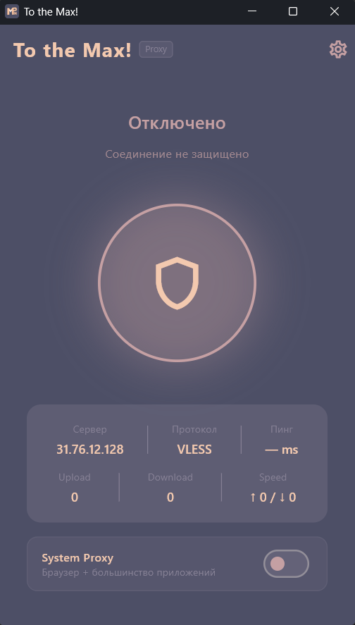
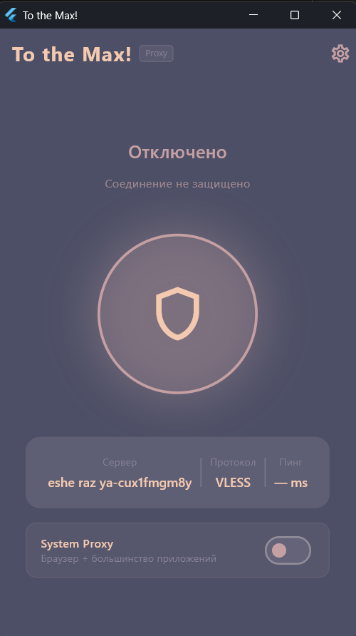
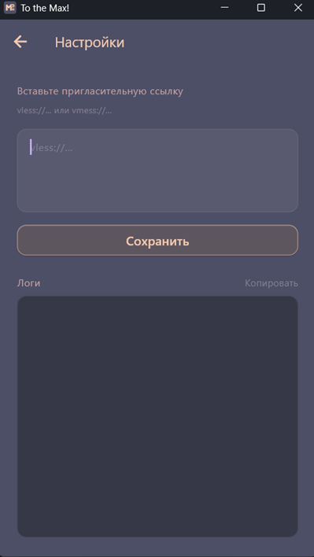

# To the Max VPN!

> A cross-platform VPN client built with Flutter, powered by VLESS + Reality protocol.


<p align="center">
  
  
  
</p>

---

## Features

- **Two connection modes on Windows:**
  - **System Proxy** — routes browser and most app traffic via HTTP proxy. No admin rights required.
  - **TUN Tunnel** — captures all OS-level traffic via a virtual network adapter (WinTUN). Requires administrator privileges.
- **Android support** — full device VPN via `flutter_v2ray` with TUN tunneling (all traffic routed through VPN)
- **VLESS + Reality** — TLS 1.3 encryption with uTLS fingerprint masquerading, practically undetectable by DPI
- **Mux (multiplexing)** — multiple logical streams over a single TCP connection, reduces handshakes and improves performance
- **System tray** integration (Windows) — minimize to tray, status icon updates in real time, exit cleanly
- **Single instance** — clicking the shortcut a second time brings the existing window to focus
- **Live logs** — real-time connection log with color coding, copyable to clipboard
- **Ping display** — measures TCP round-trip time to the server before connecting
- **Persistent config** — saves your invite link across sessions

---

## Architecture

```
lib/
├── main.dart                    # App entry, window_manager + tray init
├── screens/
│   ├── home_screen.dart         # Main UI — connect button, mode toggle, stats
│   └── config_screen.dart       # Invite link input + live logs
└── services/
    ├── vpn_backend.dart          # Abstract backend interface
    ├── vpn_service.dart          # Facade — picks backend by platform
    ├── windows_vpn_backend.dart  # Windows: xray.exe + system proxy / TUN
    ├── android_vpn_backend.dart  # Android: flutter_v2ray + tun2socks
    └── tray_service.dart         # Windows tray icon + context menu
```

### Windows — System Proxy mode

```
Flutter UI
  └─ WindowsVpnBackend
        ├─ extracts bundled xray.exe to AppData
        ├─ writes VLESS config JSON (with Mux enabled)
        ├─ launches xray.exe (SOCKS5 :10808, HTTP :10809)
        └─ sets Windows registry proxy → 127.0.0.1:10809
```

### Windows — TUN Tunnel mode

```
Flutter UI
  └─ WindowsVpnBackend
        ├─ launches xray.exe (SOCKS5 :10808, Mux enabled)
        ├─ extracts bundled tun2socks.exe + wintun.dll
        ├─ launches tun2socks → WinTUN adapter "tun0"
        ├─ assigns 10.0.0.1/30 to tun0
        ├─ adds bypass route: VPN server IP → real gateway
        └─ adds default route: 0.0.0.0/0 → tun0 (metric 1)
```

### Android — VPN mode

```
Flutter UI
  └─ AndroidVpnBackend
        ├─ flutter_v2ray starts Xray core (SOCKS5 :1080)
        ├─ Android VpnService creates TUN interface
        ├─ libtun2socks.so bridges TUN → SOCKS5
        └─ all device traffic routed through VPN
```

### Connection pipeline

```
App → xray (Mux) → 1 TCP conn → Server (Reality) → Internet
         └─ multiplexes all streams over a single encrypted connection
```

---

## Getting Started

### Prerequisites

- Flutter 3.x
- **Windows:** Windows 10/11 x64, Visual Studio 2022 with **Desktop development with C++** workload
- **Android:** Android SDK, Android 5.0+ (API 21+), tested on Android 14

### Bundled binaries (Windows only)

Place these files before building:

| File | Path | Source |
|------|------|--------|
| `xray.exe` | `assets/xray/xray.exe` | [XTLS/Xray-core releases](https://github.com/XTLS/Xray-core/releases/latest) — `Xray-windows-64.zip` |
| `tun2socks.exe` | `assets/tun2socks/tun2socks.exe` | [xjasonlyu/tun2socks releases](https://github.com/xjasonlyu/tun2socks/releases/latest) — `tun2socks-windows-amd64.exe` |
| `wintun.dll` | `assets/tun2socks/wintun.dll` | [wintun.net](https://www.wintun.net) — `amd64/wintun.dll` |
| `*.ico` | `assets/tray/` | Tray icons (connected / connecting / disconnected) |

Android uses `flutter_v2ray` which bundles Xray core and tun2socks natively — no extra binaries needed.

### Build

**Windows:**
```bash
flutter pub get
flutter build windows
```

The output is at `build\windows\x64\runner\Release\vpn_client.exe`.

> **TUN mode requires the app to run as Administrator.** The manifest is already configured with `requireAdministrator`.

**Android:**
```bash
flutter pub get
flutter build apk
```

The APK is at `build/app/outputs/flutter-apk/app-release.apk`.

> ⚠️ `AndroidManifest.xml` must have `android:extractNativeLibs="true"` and `build.gradle.kts` must have `useLegacyPackaging = true` — otherwise `libtun2socks.so` stays inside the APK and can't be executed as a process.

### Run in development

**Windows** (open a terminal **as Administrator**):
```bash
flutter run -d windows
```

**Android:**
```bash
flutter run -d <device_id>
```

---

## Usage

1. Launch the app
2. Click the **gear icon** → paste your `vless://...` invite link → **Save**
3. **Windows:** choose mode with the toggle at the bottom:
   - **System Proxy** — browsers and most apps
   - **TUN Tunnel** — all OS traffic (full VPN)
4. **Android:** tap the shield button → accept VPN permission → connected
5. Closing the window on Windows minimizes to tray. Right-click the tray icon → **Exit** to quit

### Server requirements

The client is designed for VLESS + Reality servers. Recommended setup:

- **Panel:** [3x-ui](https://github.com/MHSanaei/3x-ui) or similar
- **Protocol:** VLESS
- **Network:** TCP
- **Security:** Reality
- **Flow:** _(leave empty — Mux is used instead of xtls-rprx-vision)_
- **uTLS fingerprint:** `chrome`

> ⚠️ **Important:** Do not enable `xtls-rprx-vision` flow on the server — it is incompatible with Mux multiplexing.

---

## Roadmap

- [x] Windows — System Proxy mode
- [x] Windows — TUN Tunnel mode
- [x] Android — full VPN mode
- [x] System tray with live status
- [x] VLESS + Reality support
- [x] Mux multiplexing
- [ ] iOS support
- [ ] Auto-reconnect on network change
- [ ] Kill switch
- [ ] Multiple server profiles
- [ ] Split tunneling
- [ ] Traffic / speed stats

---

## Dependencies

| Package | Purpose |
|---------|---------|
| `window_manager` | Window controls, prevent-close → minimize to tray |
| `tray_manager` | System tray icon and context menu |
| `windows_single_instance` | Single app instance enforcement |
| `shared_preferences` | Persistent config storage |
| `path_provider` | AppData directory for extracted binaries |
| `flutter_v2ray` | Android VPN backend (Xray core + tun2socks) |

---

## License

GPL-3.0